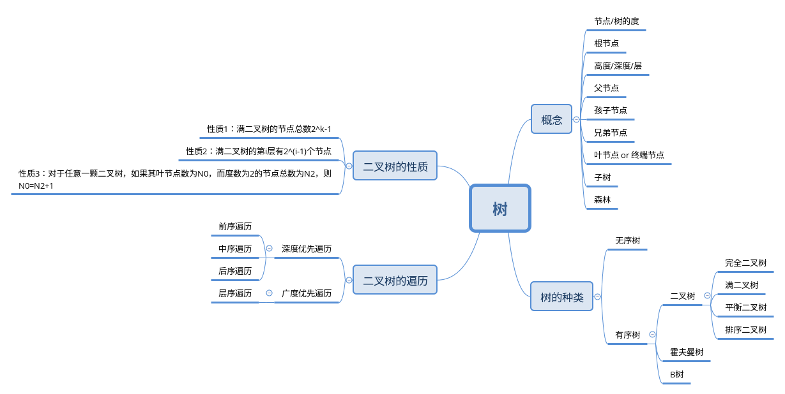

> - 正在学习的算法课程：《数据结构与算法之美》& "小甲鱼数据结构"
> - 传送门： [https://time.geekbang.org/column/126](https://time.geekbang.org/column/126)
> - 新发现的宝贝1：[https://pegasuswang.github.io/python_data_structures_and_algorithms/14_%E6%A0%91%E4%B8%8E%E4%BA%8C%E5%8F%89%E6%A0%91/tree/](https://pegasuswang.github.io/python_data_structures_and_algorithms/14_树与二叉树/tree/)
> - 新发现的宝贝2：[https://www.bilibili.com/video/av17888939](https://www.bilibili.com/video/av17888939)
> - 代码传送门：
> - 二叉树基本用链式存储结构
> - 2019/11/01

# 一、概念



1. 树结构是一种包括节点(nodes)和边(edges)的拥有层级关系的一种结构


# 二、二叉树

1.  二叉树是一种简单的树，它的每个节点最多只能包含两个孩子


其中，2是满二叉树，3是完全二叉树


> 满二叉树一定是完全二叉树，但是完全二叉树不一定是满二叉树

# 三、二叉树的表示 & 遍历

### 3.1 二叉树的表示

1. 首先定义一个类表示节点

   ```python
    class Node(object):
         def __init__(self, val=None, left=None, right=None):
             self.val = val
             self.left = left
             self.right = right
   ```

   


2. 定义root节点

   ```python
   class BinTree(obeject):
       def __init__(self):
           self.root = None
   ```

3. 创建一棵树

   ```python
   def add(self, elem):
       '''创建二叉树'''
       node = Node(elem)
       # 如果根节点为空，则elem作为根节点
       if not self.root:
           self.root = node
           return
       # 根节点入队
       queue = [self.root]
       while queue:
           # 父节点出队
           par_node = queue.pop(0)
           # 左节点不存在时，将elem 作为左节点，否则左节点入队
           if not par_node.left:
               par_node.left = node
               return
           else:
               queue.append(par_node.left)
               # 右节点不存在时，将elem 作为右节点，否则右节点入队
           if not par_node.right:
               par_node.right = node
               return
           else:
               queue.append(par_node.right)
   ```

### 3.2 二叉树的遍历


- 前序遍历: 根节点->左子树->右子树

  ```python
  def pre_order(self, node):
      """前序遍历"""
      if not node:
          return None
      print(node)
      self.pre_order(node.left)
      self.pre_order(node.right)
  ```

- 中序遍历: 左子树->根节点->右子树

  ```python
  def mid_order(self, node):
      """中序遍历"""
      if not node:
          return None
      self.mid_order(node.left)
      print(node)
      self.mid_order(node.right)
  ```

- 后序遍历: 左子树->右子树->根节点

  ```python
  def post_order(self, node):
      """后序遍历"""
      if not node:
          return None
      self.post_order(node.left)
      self.post_order(node.right)
      print(node)
  ```

- 层序遍历(队列实现)

  ```python
  def layer_order(self):
      """层序遍历"""
      if not self.root:
          return None
      queue = [self.root]
      while queue:
          cur_node = queue.pop(0)
          print(cur_node)
          if cur_node.left:
              queue.append(cur_node.left)
          if cur_node.right:
              queue.append(cur_node.right)
  ```

- 完整代码：

  ```python
  # coding=utf-8
  '''
  @ Summary: 递归遍历二叉树
  @ Update:  
  
  @ file:    4-1.二叉树的遍历.py
  @ version: 1.0.0
  
  @ Author:  Lebhoryi@gmail.com
  @ Date:    19-11-1 下午7:51
  '''
  import pysnooper
  
  class Node(object):
      def __init__(self, val):
          self.val = val
          self.left = None
          self.right = None
  
      def __repr__(self):
          return str(self.val)
  
  class BinTree(object):
      """二叉树"""
      def __init__(self):
          self.root = None
  
      # @pysnooper.snoop(watch="queue")
      def add(self, elem):
          '''创建二叉树'''
          node = Node(elem)
          # 如果根节点为空，则elem作为根节点
          if not self.root:
              self.root = node
              return
          # 根节点入队
          queue = [self.root]
          while queue:
              # 父节点出队
              par_node = queue.pop(0)
              # 左节点不存在时，将elem 作为左节点，否则左节点入队
              if not par_node.left:
                  par_node.left = node
                  return
              else:
                  queue.append(par_node.left)
              # 右节点不存在时，将elem 作为右节点，否则右节点入队
              if not par_node.right:
                  par_node.right = node
                  return
              else:
                  queue.append(par_node.right)
  
  
      def layer_order(self):
          """层序遍历"""
          if not self.root:
              return None
          queue = [self.root]
          while queue:
              cur_node = queue.pop(0)
              print(cur_node)
              if cur_node.left:
                  queue.append(cur_node.left)
              if cur_node.right:
                  queue.append(cur_node.right)
  
      def pre_order(self, node):
          """前序遍历"""
          if not node:
              return None
          print(node)
          self.pre_order(node.left)
          self.pre_order(node.right)
  
      def mid_order(self, node):
          """中序遍历"""
          if not node:
              return None
          self.mid_order(node.left)
          print(node)
          self.mid_order(node.right)
  
      def post_order(self, node):
          """后序遍历"""
          if not node:
              return None
          self.post_order(node.left)
          self.post_order(node.right)
          print(node)
  
  
  if __name__=="__main__":
      tree = BinTree()
      for i in range(65,72):
          tree.add(chr(i))
      # tree.layer_order()
      # tree.pre_order(tree.root)
      # tree.mid_order(tree.root)
      tree.post_order(tree.root)
  ```

# 四、代码练习

1. 左右反转二叉树
2. 给定前序和后序构造二叉树


